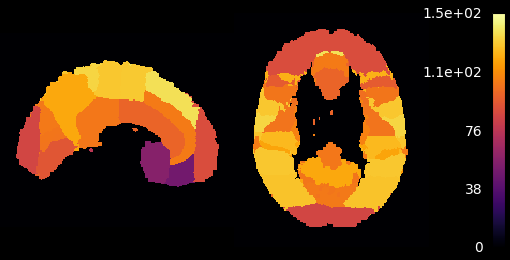
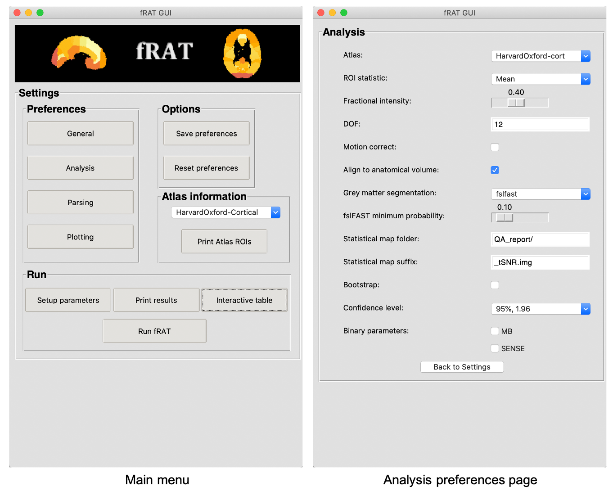
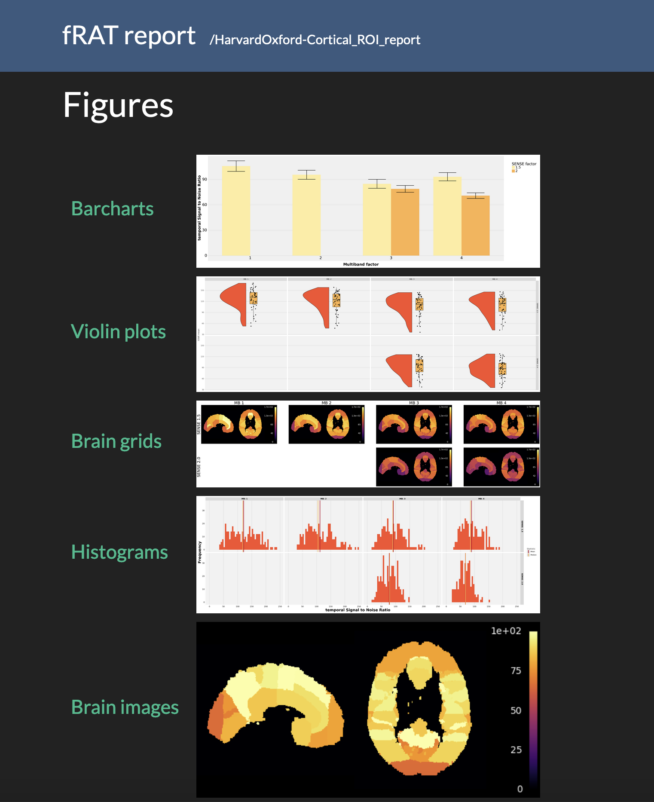

# fRAT - fMRI ROI Analysis Tool
 

fRAT is an open-source python-based application used to simplify the processing and analysis of fMRI data by
converting voxelwise maps into ROI-wise maps.

> This project is under active development.
>
> fRAT is written using **Python version 3.10.0** for **MacOS** and is based on Nipype.

Documentation:

[Home page](https://fmri-roi-analysis-tool.readthedocs.io)

[Installation instructions](https://fmri-roi-analysis-tool.readthedocs.io/en/latest/installation.html)

[ROI analysis tutorial](https://fmri-roi-analysis-tool.readthedocs.io/en/latest/tutorials/Basic-ROI-analysis.html)

## Running fRAT
The `fRAT.py` or `fRAT_GUI.py` files are used to run the non-GUI or GUI versions of fRAT respectively.
Configuration settings can be changed in the GUI, alternatively they can be changed directly in the config.toml files.
For shell scripting multiple analyses/plots, flags can be passed when running fRAT.py to specify the fMRI file locations
(for scriping multiple analyses), or the location of the JSON files outputted by the fRAT (for scripting
plotting/statistics), e.g. `fRAT.py --brain_loc BRAIN_LOC --json_loc JSON_LOC`, however using flags to script
statistical map creation is not currently possible. Help text for available flags can be
accessed with the command: `fRAT.py --help`.

## Images

## Versioning
We use [Semantic versioning](http://semver.org/) for versioning. For the versions available, see the
[tag list](https://github.com/elliohow/fMRI_ROI_Analysis_Tool/tags) for this project.

## Licensing
This project uses the Apache 2.0 license. For the text version of the license see
[here](https://github.com/elliohow/fMRI_ROI_Analysis_Tool/blob/master/LICENSE).
