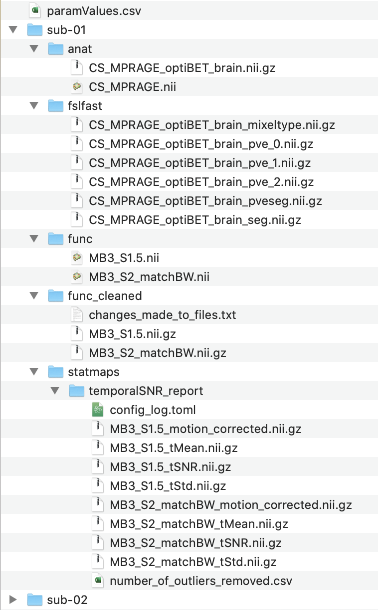

================
Folder structure
================
The following section details the folder structure needed to run the fRAT and the structure of the folder outputted by
running the fRAT. An example of the folder structure needed to run the fRAT is given
`here <https://github.com/elliohow/fMRI_ROI_Analysis_Tool/tree/master/example_data>`_. In this example 'QA_report' is the name of
the folder containing the statistical map files and 'HarvardOxford-Cortical_ROI_report' is the folder that has been
output by the fRAT.

Folder structure for running fRAT
---------------------------------
The base folder is the folder which contains all the files to be used by the fRAT. Before running the fRAT analysis,
the base folder should be structured like this:

| │ Base folder
| ├── stat_maps (name can be chosen by user)
| │   └── NIFTI/Analyze statistical map files
| │
| ├── anat
| │   ├── skull stripped anatomy file (should have '_brain' extension)
| │   └── anatomical file (necessary if using BBR cost function)
| │
| ├── fslfast (optional but recommended)
| │   └── ... (All files output by fslfast)
| │
| ├── NIFTI/Analyze fMRI files
| └── paramValues.csv (created through GUI)

Therefore, an example folder structure with two subjects would be:

| │ Base folder
| │
| ├── paramValues.csv
| │
| ├── sub-1
| │   ├── anat
| │   │   ├── MPRAGE.nii
| │   │   └── MPRAGE_stripped_brain.nii
| │   │
| │   ├── fslfast
| │   │   └── ... (All files output by fslfast)
| │   │
| │   ├── func
| │   │   ├── P1_MB3_S2_matchBW.nii
| │   │   └── P2_MB1_S3_matchBW.nii
| │   │
| │   ├── func_cleaned
| │   │   ├── changes_made_to_files.txt
| │   │   ├── P1_MB3_S2_matchBW.nii
| │   │   └── P2_MB1_S3_matchBW.nii
| │   │
| │   └── statmaps
| │       └── temporalSNR_report
| │           └── config_log.toml
| │           └── P1_MB3_S2_matchBW_tSNR.nii
| │           └── P2_MB1_S3_matchBW_tSNR.nii
| │
| └── sub-2
|     └── ... (Folders in the same format as for sub-1)

| HarvardOxford-Cortical_ROI_report
| │
| ├── additional_info.csv
| ├── analysis_log.toml
| ├── copy_paramValues.csv
| ├── index.html
| │
| ├── Figures
| │   ├── figure_log.toml
| │   ├── Barcharts
| │   │   └── ...
| │   ├── Brain_grids
| │   │   └── ...
| │   ├── Brain_images
| │   │   └── ... (Individual images of brains used for the brain grid images)
| │   ├── Histograms
| │   │   └── ...
| │   └── Violin_plots
| │       └── ...
| │
| ├── fRAT_report
| │   └── ... (Pages of HTML report accessed using index.html)
| │
| ├── Statistics
| │   └── stats
| │       ├── statistics_log.toml
| │       ├── statistics_terminal_output.txt
| │       └── ... (Folders containing statistics results)
| │
| ├── Overall
| │   ├── NIFTI_ROI
| │   │   ├── Participant_averaged_results
| │   │   │   └── ... (NIFTI-GZ files used to create the files in the 'Brain_images' folder)
| │   │   └── Session_averaged_results
| │   │       └── ... (NIFTI-GZ files used to create the files in the 'Brain_images' folder)
| │   │
| │   ├── Raw_results
| │   │   └── ... (JSON files containing non-summarised results for every ROI)
| │   │
| │   └── Summarised_results
| │       ├── Participant_averaged_results
| │       │   └── ... (JSON files containing summarised results for each ROI)
| │       └── Session_averaged_results
| │           └── ... (JSON files containing summarised results for each ROI)
| │
| ├── sub-1
| │   ├── Excluded_voxels
| │   │   └── ...
| │   ├── Intermediate_files
| │   │   └── ... (All intermediate files created during analysis)
| │   ├── Raw_results
| │   │   └── ... (JSON files containing non-summarised results for every ROI)
| │   └── Summarised_results (JSON files containing summarised results for each ROI)
| │       ├── ... (JSON files containing summarised results for each ROI)
| │       └── Averaged_results
| │           └── ... (JSON files showing the mean average across all sessions)
| └── sub-2
|     └── ... (Folders in the same format as for sub-1)

Example of how to write up folder structure:
Folder structure
================
Let’s start by showcasing the folder structure that we should aim for. Here is the folder structure of an example project, named ``simpleble`` (See `GitHub <https://github.com/sglvladi/simpleble>`_ repo and `ReadTheDocs <http://simpleble.readthedocs.io/en/latest/index.html>`_ documentation), which is also the package which we will base our tutorial on:

| simpleble-master
| ├── docs
| │   ├── build
| │   ├── make.bat
| │   ├── Makefile
| │   └── source
| ├── LICENSE
| ├── README.md
| ├── requirements.txt
| └── simpleble
|     └── simpleble.py
|
|

In the folder structure above:

- ``simpleble-master`` is the folder we get when we issue a ``git pull/clone`` command
- ``simpleble-master/docs`` is the directory where our Sphinx documentation will reside
- ``simpleble-master/docs/build`` and ``simpleble-master/docs/source`` being the Sphinx build and source directories respectively. These folders are autogenerated for us by Sphinx.
- ``simpleble-master/simpleble`` is the actual Python package directory, where our Python source files reside.

An important note here is that the folder ``simpleble-master`` is what we will refer to as our `Repository root`, while the folder ``simpleble-master/docs`` will be our `Sphinx root` or, equivalently, our `Documentation root`. Similarly, ``simpleble-master/docs/source`` will be our `Sphinx source root` and ``simpleble-master/docs/build`` is our `Sphinx build root`.