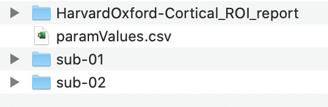

================
Folder structure
================
The following section details the folder structure needed to run the fRAT and the structure of the folder outputted by
running the fRAT. An example of the folder structure needed to run the fRAT is given
`here <https://github.com/elliohow/fMRI_ROI_Analysis_Tool/tree/master/example_data>`_. In this example
'HarvardOxford-Cortical_ROI_report' is the folder that has been output by the fRAT.

Input folder structure
----------------------

After running the analysis, in addition to the folders created before the base folder will now contain to the newly created
output folder:

Folder structure
================
Let’s start by showcasing the folder structure that we should aim for. Here is the folder structure of an example project, named ``simpleble`` (See `GitHub <https://github.com/sglvladi/simpleble>`_ repo and `ReadTheDocs <http://simpleble.readthedocs.io/en/latest/index.html>`_ documentation), which is also the package which we will base our tutorial on:

| simpleble-master
| ├── docs
| │   ├── build
| │   ├── make.bat
| │   ├── Makefile
| │   └── source
| ├── LICENSE
| ├── README.md
| ├── requirements.txt
| └── simpleble
|     └── simpleble.py
|
|

In the folder structure above:

- ``simpleble-master`` is the folder we get when we issue a ``git pull/clone`` command
- ``simpleble-master/docs`` is the directory where our Sphinx documentation will reside
- ``simpleble-master/docs/build`` and ``simpleble-master/docs/source`` being the Sphinx build and source directories respectively. These folders are autogenerated for us by Sphinx.
- ``simpleble-master/simpleble`` is the actual Python package directory, where our Python source files reside.

An important note here is that the folder ``simpleble-master`` is what we will refer to as our `Repository root`, while the folder ``simpleble-master/docs`` will be our `Sphinx root` or, equivalently, our `Documentation root`. Similarly, ``simpleble-master/docs/source`` will be our `Sphinx source root` and ``simpleble-master/docs/build`` is our `Sphinx build root`.