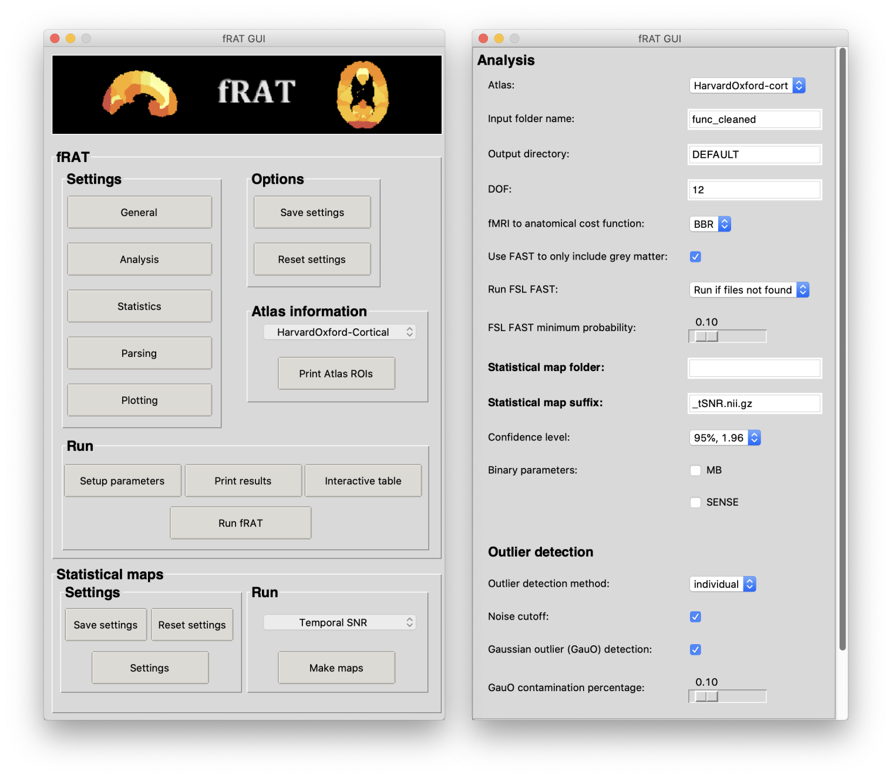

.. include:: links.rst

.. image:: images/fRAT.gif
  :width: 500

=============================
fRAT - fMRI ROI Analysis Tool
=============================

.. image:: https://joss.theoj.org/papers/cc9c0cb3b12abaf30c8381728d3229d7/status.svg
  :target: https://joss.theoj.org/papers/cc9c0cb3b12abaf30c8381728d3229d7
  :alt: Paper status

.. image:: https://img.shields.io/github/v/release/elliohow/fmri_roi_analysis_tool?style=flat-square
    :target: https://github.com/elliohow/fmri_roi_analysis_tool/releases/latest
    :alt: Github release (latest by date)

.. image:: https://img.shields.io/hexpm/l/plug?style=flat-square
  :target: https://github.com/elliohow/fMRI_ROI_Analysis_Tool/blob/master/LICENSE
  :alt: License

.. image:: https://img.shields.io/github/issues/elliohow/fmri_roi_analysis_tool?style=flat-square
    :target: https://github.com/elliohow/fmri_roi_analysis_tool/issues
    :alt: Github issues
    
.. image:: https://img.shields.io/badge/PRs-welcome-brightgreen.svg?style=flat-square
  :target: http://makeapullrequest.com
  :alt: PRs welcome!

fRAT is an open-source python-based GUI application used to simplify the processing and analysis of fMRI data by
converting voxelwise maps into ROI-wise maps.

Project repository: https://github.com/elliohow/fMRI_ROI_Analysis_Tool

.. note::
    fRAT is written using Python version |python_version| for **MacOS** and tested with FSL |fsl_version|.

.. figure:: images/ROI_example.png

    A region of interest map created using fRAT, showing the mean temporal Signal-to-Noise for each region.
    Data is displayed in MNI152 standard space and combines data from multiple subjects.

Using fRAT
----------
Installation instructions for fRAT can be found `here <https://fmri-roi-analysis-tool.readthedocs.io/en/latest/installation.html>`_.
Before running fRAT, it is also recommended that the fRAT and project dependency installation is tested. Information on how
to do this can also be found on the installation instructions page.

To learn how to run an ROI analysis, follow this :doc:`tutorial </tutorials/Basic-ROI-analysis>`.

Reporting bugs
--------------
To report a bug, please go to `fRAT's Issues <https://github.com/elliohow/fMRI_ROI_Analysis_Tool/issues/new>`_.

For other questions, issues or discussion please go to `fRAT's Discussions <https://github.com/elliohow/fMRI_ROI_Analysis_Tool/discussions>`_.

Contributing with development
-----------------------------

The `Fork & Pull Request Workflow <https://docs.github.com/en/get-started/quickstart/contributing-to-projects>`_ is used for contributing. Below is a summary of the necessary steps for this workflow:

1. Fork this repository.
2. Clone the repository at your machine.
3. Add your changes in a branch named after the feature (`lower-case-with-hyphens`).
4. Make a pull request to `fRAT`, targeting the `master` branch.

GUI images
----------

HTML report images
------------------
.. image:: images/HTML_report.png
  :width: 900

Versioning
----------
We use `Semantic versioning <http://semver.org/>`_ for versioning. For the versions available, see the
`tag list <https://github.com/elliohow/fMRI_ROI_Analysis_Tool/tags>`_ for this project.

Licensing
---------
This project uses the Apache 2.0 license. For the text version of the license see
`here <https://github.com/elliohow/fMRI_ROI_Analysis_Tool/blob/master/LICENSE>`_.
Prior to version 1.0.0, this project used an MIT license.

.. toctree::
    :caption: Contents
    :maxdepth: 3

    Home <self>
    key_concepts_of_frat
    installation
    tutorials
    troubleshooting
    future_additions
