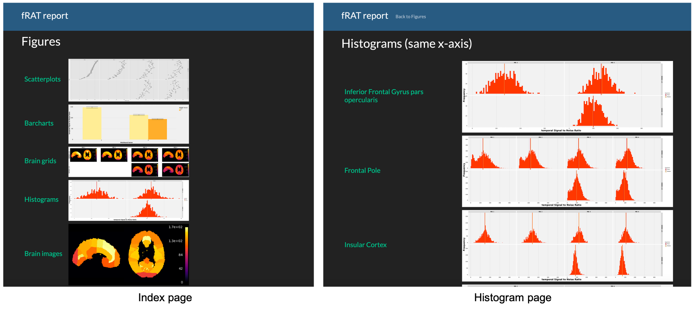

.. include:: links.rst

.. image:: images/fRAT.gif
  :width: 500

=============================
fRAT - fMRI ROI Analysis Tool
=============================
fRAT is an open-source python-based GUI application used to simplify the processing and analysis of fMRI data by
converting voxelwise maps into ROI-wise maps.

.. note::
    fRAT is written using Python version |python_version| for **MacOS** and tested with FSL |fsl_version|.

.. image:: https://img.shields.io/badge/PRs-welcome-brightgreen.svg?style=flat-square
  :target: http://makeapullrequest.com
  :alt: PRs Welcome!

.. image:: https://img.shields.io/hexpm/l/plug?style=flat-square
  :target: https://github.com/elliohow/fMRI_ROI_Analysis_Tool/blob/master/LICENSE
  :alt: License information

About
-----
.. figure:: images/ROI_example.png

    A region of interest map created using fRAT, showing the mean temporal Signal-to-Noise for each region.
    Data is displayed in MNI152 standard space and combines data from multiple subjects.

Project repository: https://github.com/elliohow/fMRI_ROI_Analysis_Tool

Using fRAT
----------
Installation instructions for fRAT can be found `here <https://fmri-roi-analysis-tool.readthedocs.io/en/latest/installation.html>`_.
Before running fRAT, it is also recommended that the fRAT and project dependency installation is tested. Information on how
to do this can also be found on the installation instructions page.

To learn how to run an ROI analysis, follow this :doc:`tutorial </tutorials/Basic-ROI-analysis>`.

.. note::
    If using a virtual environment, the virtual environment must be activated whenever running fRAT.

    For example, if using ``conda``, activate the virtual environment with::

    $ conda activate fRAT

    If using the built in ``venv`` package, instead use::

    $ source fRAT/bin/activate

GUI images
----------
.. image:: images/GUI.png
  :width: 700

HTML report images
------------------

Versioning
----------
We use `Semantic versioning <http://semver.org/>`_ for versioning. For the versions available, see the
`tag list <https://github.com/elliohow/fMRI_ROI_Analysis_Tool/tags>`_ for this project.

Licensing
---------
This project uses the Apache 2.0 license. For the text version of the license see
`here <https://github.com/elliohow/fMRI_ROI_Analysis_Tool/blob/master/LICENSE>`_.

.. toctree::
    :caption: Contents
    :maxdepth: 3

    Home <self>
    key_concepts_of_frat
    installation
    tutorials
    troubleshooting
    future_additions
