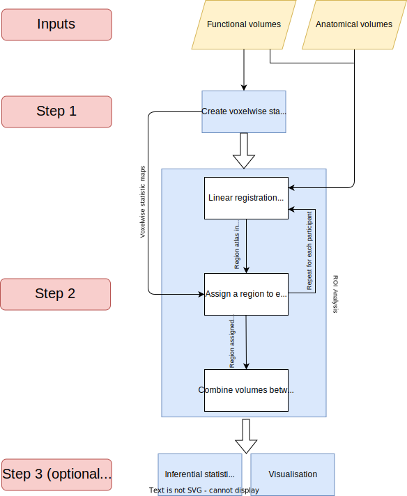

.. include:: links.rst

====================
Key concepts of fRAT
====================
.. contents:: :local:

.. figure:: images/voxelwise_and_roi_example.png

    Representation of how ROI-wise maps are produced. Data from a single participant is shown here.
    **(A)** Voxelwise tSNR map (in native space). **(B)** Harvard-Oxford Cortical atlas regions assigned to participant
    (in native space). **(C)** Combination of **(A)** and **(B)** to produce final ROI-wise tSNR map (in standard space).

As seen in the figure below, fRAT contains 3 main components: voxelwise map creation, ROI analysis, and
inferential statistics and visualisation. Each step component a configuration log file to log what
settings were used during this step. The ROI analysis step requires: functional volumes, anatomical
volumes, and voxelwise statistical maps. While voxelwise statistical maps can be created using fRAT itself, any
voxelwise map can be used for the ROI analysis.

