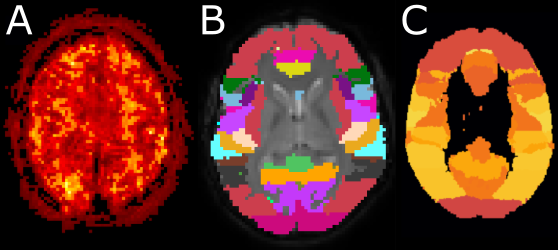

.. include:: links.rst

====================
Key concepts of fRAT
====================
.. contents:: :local:

Representation of how ROI-wise maps are produced. Data from a single participant is shown here. All figures are in
native space apart from **(D)**, which is in standard space. **(A)** Original functional volume. **(B)** Voxelwise temporal
signal-to-noise ratio (tSNR) map. **(C)** Harvard-Oxford Cortical atlas regions assigned to participant. **(D)** Combination of
**(B)** and **(C)** to produce final ROI-wise tSNR map.

As seen in the figure below, fRAT contains 3 main components: voxelwise map creation, ROI analysis, and
inferential statistics and visualisation. Each step component a configuration log file to log what
settings were used during this step. The ROI analysis step requires: functional volumes, anatomical
volumes, and voxelwise statistical maps. While voxelwise statistical maps can be created using fRAT itself, any
voxelwise map can be used for the ROI analysis.

.. image:: images/process_overview.svg

