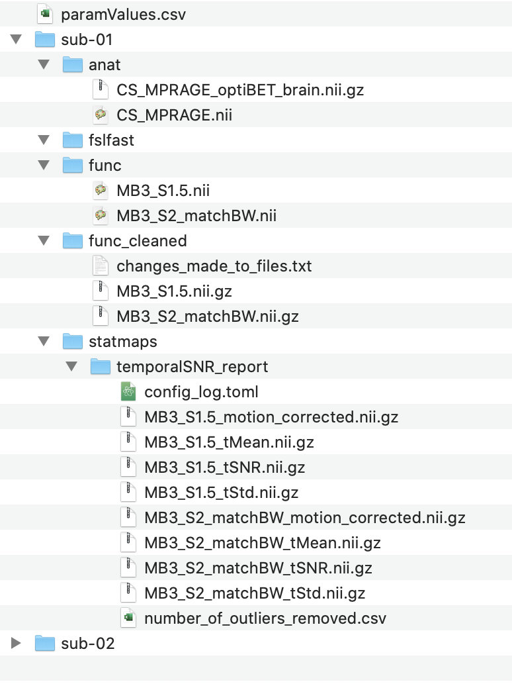

.. include:: links.rst

=====
Usage
=====
This page will first explain key concepts of fRAT and then will give instructions on how to use fRAT to:

#. Create a voxel-wise tSNR map
#. Convert this voxel-wise map into an ROI based map
#. Produce figures and statistically analyse this data

.. note::
    It is recommended that the fRAT is first ran using the files in the ``example_data`` folder to test whether the project
    dependencies are correctly installed. This folder also gives demonstrates the input necessary for the fRAT and
    the output produced by the fRAT.

.. contents:: :local:

Key concepts of fRAT
====================
The ROI analysis pipeline has 3 main steps: ROI analysis, statistical analysis and figure creation; the latter two steps
requiring the ROI analysis step to first be ran. Each step outputs a configuration log file to log what
settings were used during this step. As seen in the image below, the fRAT requires: functional volumes, anatomical
volumes, voxelwise statistical maps and optionally (but recommended for cortical ROIs) an FSL FAST segmentation.

.. image:: images/entire_process.png

Usage
=====
The ``fRAT.py`` or ``fRAT_GUI.py`` files are used to run the non-GUI or GUI versions of fRAT respectively.
Configuration settings can be changed in the GUI, alternatively they can be changed directly in the config.toml files.
For shell scripting multiple analyses/plots, flags can be passed when running fRAT.py to specify the fMRI file locations
(for scriping multiple analyses), or the location of the JSON files outputted by the fRAT (for scripting
plotting/statistics), e.g. `fRAT.py --brain_loc BRAIN_LOC --json_loc JSON_LOC`. Help text for available flags can be
accessed with the command: `fRAT.py --help`.

.. note::
    This tutorial will focus on how to use the GUI version of the fRAT, as while many settings and functions can be
    accessed without the GUI, it is suggested that the GUI is used where possible until you already have familiarity
    with fRAT.


Tutorial
========
File setup
----------
.. tip::
    In the GUI, settings that will most often need changing are **bold**. Additionally, most settings have a tooltip
    giving an explanation of what the setting changes, and if relevant, how the format the setting expects.

Before being able to run the ROI analysis, a few initial setup steps need to be taken. Firstly, the base folder should
be structured with functional files organised into folders named using the format ``sub-{number}`` (e.g. ``sub-42``):


Next, enter the "Parsing" options menu found under the "Settings" panel in the GUI. The "critical parameters" setting
indicates what are the independent variables of the experiment and will be used when labelling plots, whereas the
"critical parameters abbreviation" setting indicates how these variables are represented in the filenames of the scans
(if at all). For example, the "critical parameters" option may contain "Multiband, Sense", whereas the "critical
parameters abbreviation" option will instead contain "mb, s". In this case, the file name ``P1_MB3_S2_matchBW.nii``
will represent that multiband 3 and SENSE 2 were used.

After filling these options in, select the "Make folder structure" option. This will create the basic folder structure
required for the fRAT and will sort the files into the correct directory. After returning to the home
page, click the "Setup parameters" button in the "Run" panel of the GUI. This will parse files names for critical
parameters using the "critical parameters abbreviation" option set above, with the output being saved in
``paramValues.csv``. This file should be checked before proceeding to make sure the correct parameters have been applied
to each file. Alternatively, when running without the GUI, pass the --make_table flag when running ``fRAT.py``, e.g.
``fRAT.py --make_table``. After using the parsing GUI option, the necessary directories will be created with the files
put into the folder ``func``:


.. warning::
    Make sure the lists of critical parameters given are in the same order, otherwise the critical parameter names
    will be applied to the wrong abbreviations.

In the newly created ``anat`` folder, place a single skull stripped anatomical volume with the suffix "_brain". The
default BBR cost function for functional to anatomical registration requires a second, whole head, non-brain extracted
volume to also be placed in the ``anat`` folder. This second file should not contain the word "brain" in the file
name. While the BBR cost function also requires segmentation to have been ran using FAST, FAST will be automatically ran
when running the analysis if this is not the case. However if you wish to run the segmentation ahead of time,
the FAST output should be placed in the ``fslfast`` folder. If running the analysis on cortical regions (for example
when using the Harvard-Oxford Cortical atlas), it is recommended that white matter and extracranial voxels are excluded
from the analysis by setting the GUI option "Use FAST to only include grey matter" to true. While there is not
currently support for using FAST to improve analysis of subcortical regions, support may be added in the future.

If FAST needs to be ran (either for BBR registration or to include only grey matter in the analysis) the accuracy of the
skull stripped anatomical scans should still be assessed before running it. As overly conservative skull stripping can
lead to skull being retained in the Resulting image, which FAST may then misidentify as grey matter.
Conversely, overly liberal skull stripping can lead to parts of the brain being removed, meaning that these voxels will
also not be included in any ROIs.

.. note::
    To skull strip the anatomical files, it is highly recommended that optiBET_ is used as it has consistently produced
    the best brain extraction accuracy.

Voxel-wise tSNR map creation
----------------------------
Before creating the tSNR maps, click the "Settings" button in the "Statistical maps" section of the GUI. The default
options will normally be sufficient, however if a noise scan has been added to the functional volumes, make sure under
the "Image SNR calculation" header that information about this noise volume is given. This allows the fRAT to remove it
when creating tSNR maps, and if creating iSNR maps, it will be used to calculate the noise value.

After inspecting the settings, to create the tSNR maps return to the home screen and in the "Run" panel of the
"Statistical maps" section, select "Temporal SNR" from the dropdown menu then click "Make maps". A file explorer will
appear allowing you to navigate to the base folder where your subject folders are located. After selecting this base
folder, the tSNR will be created for each participant. During creation of the maps, the folder ``func_cleaned``
will be created, which contains functional volumes better suited to be used for the ROI analysis.



.. note::
    The ``changes_made_to_files.txt`` contain details of how the files have been cleaned. While ``func_cleaned`` is the
    default folder that the ROI analysis will search for function volumes in, if you are unhappy with using
    these files over the original files, this option can be changed using the ``Input folder name``
    setting on the analysis screen of the GUI.

Running the ROI analysis
------------------------
The same process for creating voxel-wise maps applies here, check each options menu from the "Settings" panel in the
"fRAT" section of the GUI and then click the "Run fRAT" button to run the ROI analysis when you are ready to run the
analysis. Again, the default options should be sufficient, however the **bolded** options are the ones most likely to
need changing. In particular, the "General" option menu allows ROI analysis pipeline steps to be skipped if desired.
Further, the "Statistical map folder" setting in the "Analysis" option menu should be changed to "temporalSNR_report".
If you wish to analyse any of the other files output by the tSNR map creation, the "Statistical map suffix" option can
for example be changed to "tStd.nii.gz". The ``Atlas information`` option on the home page allows you to print the
ROIs and their corresponding numeric key for the atlas chosen from the dropdown menu. This allows you to both select
which atlas is more appropriate to use for analysis, but also allows you to specify using this numeric tags which
ROIs to produce figures and statistics for, e.g. ``1,5,32`` to choose specific ROIs or ``all`` for all ROIs.

.. note::
    If running the ``Plotting`` or ``Statistics`` steps separately, the folder output by the analysis should be selected
    instead of the base folder.

Exploring ROI analysis output
-----------------------------
After running the analysis, in addition to the folders created before, the base folder will now contain the newly created
output folder:

.. image:: images/input_folder_analysis.png
    :width: 200

In this folder, ``Overall/Summarised_results/`` will contain
``Participant_averaged_results`` and ``Session_averaged_results``. Participant averaged results refers to region of
interest (ROI) results being first averaged within participants before being averaging between participants (i.e. the
more traditional method). Whereas session averaged results instead averages the ROI results between all sessions,
disregarding which participant was scanned in each session; this can be useful where the statistical map being converted
should be participant agnostic. ``combined_results.json`` found in these folders contains the final summary results of the
data.

Figure creation also makes html file

.. note::
    For plotting, as scaling of brain grid figures are calculated during the analysis step, scaled brain grid figures
    should only be used if all files analysed together are also displayed together, otherwise the scaling will be based
    on files which are not present in the figures. WHAT DOES THIS MEAN

Statistical map creation
------------------------

Both the  and `interactive table` GUI options can be used to explore the data once the analysis has
been ran. The `print results` option prints the results for the selected region of interests to the terminal, whereas
the `interactive table` option opens up the result in a browser window.


## Potential errors
### Multicore processing
On some Mac OS systems, multicore processing may cause the below issue:

```objc[16599]: +[__NSCFConstantString initialize] may have been in progress in another thread when fork()```

#### Solution
In the terminal, edit your bash_profile with:

```nano ~/.bash_profile```

At the end of the bash_profile file add the line:

```export OBJC_DISABLE_INITIALIZE_FORK_SAFETY=YES```

Then save and exit the bash_profile. Solution originally found here:
[Link](https://stackoverflow.com/questions/50168647/multiprocessing-causes-python-to-crash-and-gives-an-error-may-have-been-in-progr)

Make sure there are no spaces in the path to the folder you want to analyse