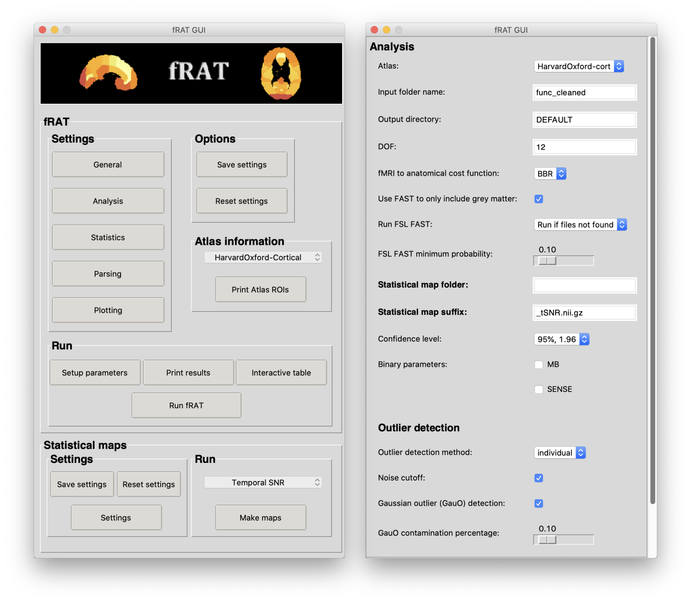
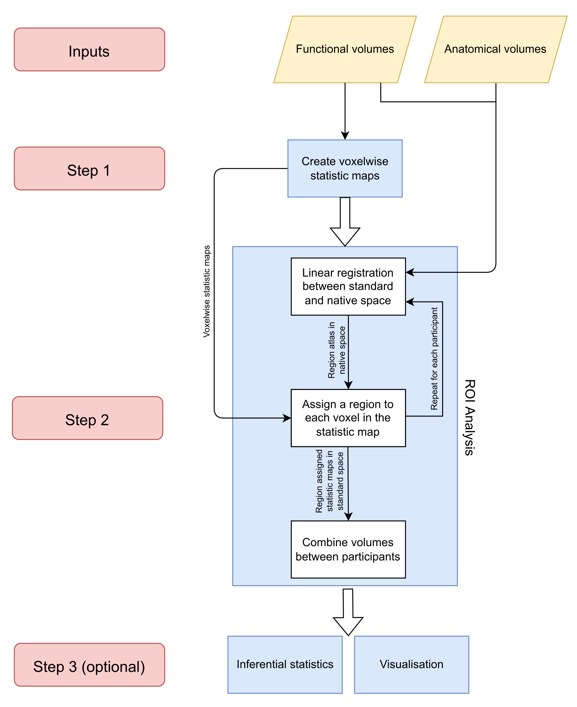

# Summary

Functional magnetic resonance imaging (fMRI) is widely used to address basic cognitive as well as clinical neuroscience questions. The specific choice of imaging sequence and parameters used for image acquisition can have a marked effect on the acquired data. The choice of different parameter settings used for the echo-planar imaging (EPI) acquisition include the trade-offs between an increase in-plane parallel acceleration factor (SENSE, GRAPPA, ASSET) to reduce geometric distortions and increase in Multiband (MB) factor to reduce scan time, both of which lead to spatially dependent noise amplification. In addition, the T2* varies across the brain influencing the optimal echo time (TE)[@clareSingleshotMeasurementEstablish2001]. Assessing how these parameters affect data quality over brain regions is crucial. Such data quality metrics, in particular temporal signal-to-noise ratio (tSNR) of the fMRI scan, can be used to optimise fMRI scan parameters for a chosen set of regions-of-interest (ROI). Reporting of data quality metrics (such as tSNR and image SNR (iSNR)) is often performed over the whole brain or for a small number of manually defined voxels. Importantly, this can obscure important inter-regional differences in data quality metrics. There is currently a lack of easy-to-use tools to analyse these data quality metrics, as well as functional statistical measures (such as beta maps or similar) simultaneously across multiple ROIs.

The goal of the fMRI ROI Analysis Tool (fRAT), presented here, is to provide a toolset to address this gap, and provide a straightforward method for conducting ROI-wise analyses of fMRI metrics.

# Statement of need

There are several tools that provide functionality to report ROI-wise summaries, including the widely used `Freesurfer` infrastructure [@fischlFreeSurfer2012] and packages built on top of them. For example, the `R` packages `ggseg` and `ggseg3d` [@mowinckelVisualizationBrainStatistics2020] can be used to show aggregated data such as cortical thickness in atlas-derived regions of interest. However these packages are designed primarily for use with anatomical datasets and would require some additional coding for use with fMRI data quality and statistical metrics. Several tools do provide data quality metrics for fMRI datasets, such as `fMRIPrep` [@estebanFMRIPrepRobustPreprocessing2019a] and `MRIQC` [@estebanMRIQCAdvancingAutomatic2017]. However, these tools either report voxelwise maps or aggregate metrics over the entire brain instead of chosen ROIs. This can obscure important inter-regional differences which may be particularly informative for optimizing scanning parameters for planned experiments

`fRAT` is an open source, python-based application which focuses on ROI-wise analysis of fMRI data, by providing an easy to use and flexible pipeline for converting voxelwise data into ROI-wise data. The provided plotting options can be used to customize different aspects of the data, such as the spatial distribution of the metric of interest (\autoref{fig:brain_images}), while the statistical tools facilitate univariate and multivariate analyses within ROIs. The graphical user interface is designed to provide a user-friendly way to run and customize the settings of `fRAT` (\autoref{fig:GUI}) and [documentation](https://fmri-roi-analysis-tool.readthedocs.io/en/latest/) is available to provide information on installation and usage of fRAT. `fRAT` relies heavily on the python library `Nipype` to access the analysis tools provided by FSL [@jenkinsonFSL2012].

The user provides a 4D fMRI timeseries as an input, from which the voxelwise maps of data quality metrics (e.g. tSNR) are computed within fRAT. Alternatively, pre-computed data quality maps can be used. In addition, the ROI analysis requires a structural scan (MPRAGE) which should be skull stripped (using FSL’s BET [@smithFastRobustAutomated2002], or preferably, using optiBET [@lutkenhoffOptimizedBrainExtraction2014]) in order to run (\autoref{fig:Pipeline}). As tSNR provides a rough estimate of activation detection power in fMRI studies [@murphyHowLongScan2007; @welvaertDefinitionSignalToNoiseRatio2013], calculating this metric for multiple ROIs may be particularly useful for planning studies aimed at specific brain regions. However, as `fRAT` is designed to be used flexibly, any other voxelwise statistical map can be used as an input to the ROI analysis. `fRAT` can also be used to summarize data quality metrics for each region across participants, and is therefore also useful for larger, multi-participant datasets. The statistics and visualisation options provided by `fRAT` allow for quantitative comparisons of the effect of different fMRI sequences or hardware on data quality. This may make it particularly useful for comparisons across datasets obtained at different imaging sites.

One example use-case of the tools provided by `fRAT` is to enable imaging sites to provide guidance on the optimal fMRI parameters (such as Multiband (MB) factor [@riskWhichMultibandFactor2021], parallel imaging acceleration factor [@schmidtSensitivityencodedSENSEEcho2005] and echo time (TE) [@fazalComparisonMultibandMultiband2022]), taking into account different experimental requirements and the regions of the brain being investigated. This is beneficial as the effect of fMRI sequence and hardware on data quality metrics can vary spatially over the brain in a way that is difficult to understand without pilot data. Another potential application is for interrogation of data sets that require aggregation within ROIs, such as statistical maps for a power analysis [@geuterEffectSizePower2018]. Effect size estimations based on statistical maps from functionally derived ROIs are common in fMRI analysis, but can lead to inflated estimates if the selection criteria are not independent from the effect statistic [@kriegeskorteEverythingYouNever2010]. Defining ROIs based on atlases, as is performed with fRAT, prevents a circular analysis and leading to more accurate effect size estimations.

# Figures

# Acknowledgements

This work was supported by the Engineering and Physical Sciences Research Council [grant number EP/R513283/1].

# References
